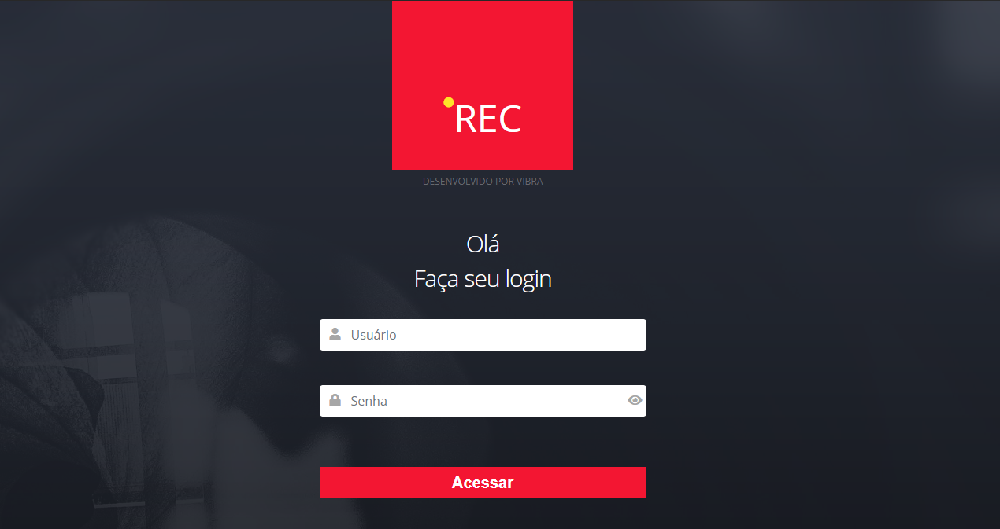
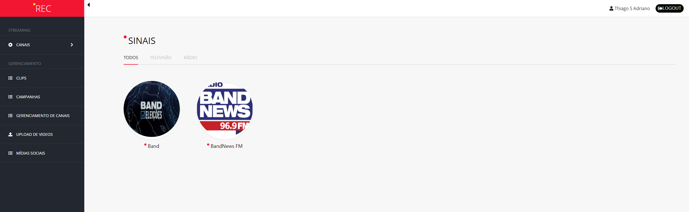
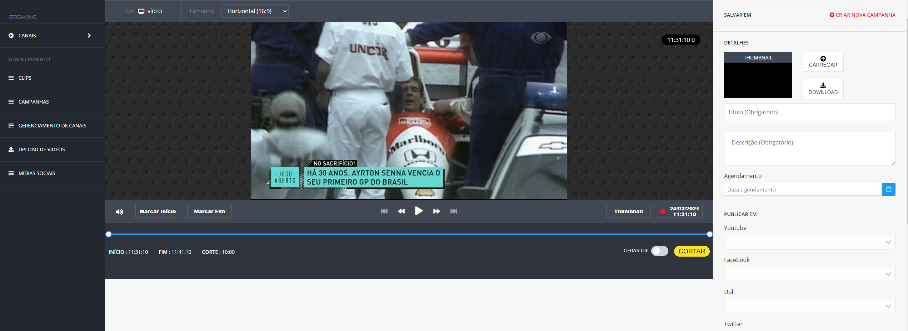
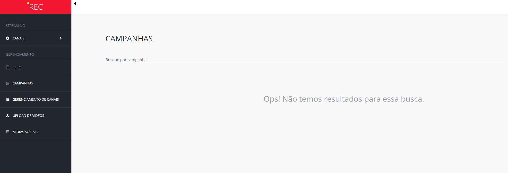
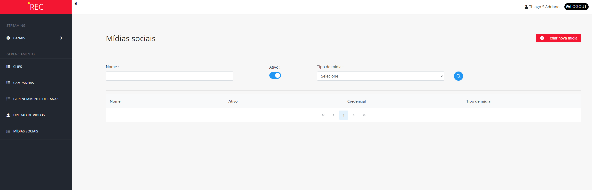

# REC GNI (Google News Iniciative) project

This project was developed by Vibra team to a GNI project to help others teams with a  structure from frontend project to show a movie, cut some slices thar movie to share in SocialMedias like Youtube, Facebook, Twitter and another players.

In this repository you can fork all repositories developed to this project that TV Bandeirantes are using nowadays.

## Contribute

[Thiago da Silva Adriano](https://github.com/programadriano)
[Gustavo Henrique de Lima Oliveira](https://github.com/GustavoLima93)
[Marcus Vinicius Morais Tobler]()
[Fabio Martins Carvalho]()
[Marcelo Nogueira da Silva]()
[Ricardo Sousa Carlim](https://github.com/ricardocarlim)


## Repositories
* SQL [link](./sqldump)
* API Auth [link](./api_auth)
* API [link](./api)
* Admin [link](./admin)


## Development 

To run this projects you need to follow the steps below:

* Create a database and run the script inside SQL folder
* Run de API project
* Run de API Auth project (user: thiago and password: 102030)
* Run de ADM project

### Database

This project are using SQL Server, you can use a instance that you have instaled in your desktop or you can use Docker to create this environment. The steps that We'll show here are using Docker.

```docker
docker run -e 'ACCEPT_EULA=Y' -e 'SA_PASSWORD=yourStrong(!)Password' -p 1433:1433 -d mcr.microsoft.com/mssql/server:2017-latest
```

With your environment OK, you need to run this script [link](./sqldump/dump.sql).

### ApiAuth

This API was developed in .NET 5 with JWT. To run this project you can use VS Code ou VS 2019. [link](./api_auth)

Credentials:
User: thiago
Password: 102030

### API

This API was developed in .NET 5 and a simples pattern to separate the solutions in some layers. To run this project you can use VS Code ou VS 2019. [link](./api)

### Admin

This is a core project, here you can manager your data like cut videos, audio, upload video from your desktop, create your campain...etc

Login



Channels



Edit Content
In this page you can cut videos, download thumb from video and share your content



Campain


Social Media
